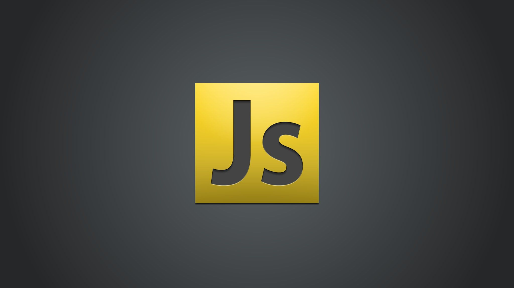

# JavaScript30
Intermediate to Pro practice course

I started this repository to fill my gaps with JavaScript language, but as time went on I thought why not turn this into a library
where anyone can learn something. 
This repository is public and encourages forking with other users to contribute to open source by helping others learn
tough topics of JavaScript.

For nearly every lesson there is a *Useful links* file where you'll find more detailed docs regarding the lesson,
as well as videos that will explain to you how things work. 
I'm also adding coding challenges which can be found in Challenges directory.

### Contributions

If you'd like to contribute, please do, but please, please, please, **don't** change code in files I created. If you don't like my code
or you think I made a mistake, please write your own code in your own **file**. 
The reason why I asking you to make your own files, instead of editing the existing ones is because I initially wrote this code
to help myself learn in way I can understand it.

One last important thing to say is that lessons are **not** connected. 
There is no **start** script. If you see any scripts in *package.json* file, these are not connected to one project, but rather spread across multiple lessons and used where needed.

### Where to next?

As you can see the list is almost complete. All lessons I intend to cover are listed below, but the list doesn't have to stop there. So I'm asking myself **where to next**?
Maybe you know some Javascript tehnology I haven't covered yet. If so, feel free the add a new lesson and code on!
I'm excited to learn new techonologies like React Native, PhaserJS, ThreeJS, GraphQL and cover them when the time is right.

With that out of the way, I wish you happy coding. 

### Lessons: 
* Lesson 1 - JS DOM, JS OOP concepts, prototypes, classes, arrays, try and catch and intervals
* Lesson 2 - Hoisting, scopes, context, closures
* Lesson 3 - Intro to ES6, Todos: spread, rest operator, destructuring, let and const vs var
* Lesson 4 - Data structures: Sets, Maps and Symbols
* Lesson 5 - Higher order functions, string functions, for of/in/each loop, object methods
* Lesson 6 - Intro to jQuery, DOM traversal, jquery vs javascript, Todos: jquery UI, validate
* Lesson 7 - Working with modules
* Lesson 8 - Build tools: Webpack, ESLint, Todos: browserify, gulp
* Lesson 9 - Todos: Callback functions
* Lesson 10 - Todos: Promises
* Lesson 11 - Todos: Ajax, old way, jquery way, fetch API ES6
* Lesson 12 - Todos: Iterators and generators
* Lesson 13 - ES7, Todos: Async Await
* Lesson 14 - Todos: Regex
* Lesson 15 - Modular Javascript, Todos: design patterns, algorithms
* Lesson 16 - Node JS core modules: fs, os, events, http...
* Lesson 17 - Express JS: routing, middlewares, hbs & ejs templating engines
* Lesson 18 - Todos: Web Sockets
* Lesson 19 - Todos: MongoDB: crud operations, operators, aggregation framework
* Lesson 20 - Todos: Mongoose: nested schemas, mongoose promises, mongoose methods
* Lesson 21 - Todos: Creating RESTAPIs: NodeJS with MongoDB, NodeJS with SQL
* Lesson 22 - Todos: Uploading files with NodeJS
* Lesson 23 - Todos: Authentication: JWT, Passport JS, Nodemailer
* Lesson 24 - Lodash
* Lesson 25 - Todos: Typescript 
* Lesson 26 - Unit testing
* Lesson 27 - ReactJS
* Lesson 28 - Todos: Redux
* Lesson 29 - Todos: D3.js
* Lesson 30 - Cool modules: Validator, Chalk, Moment, Opn...

